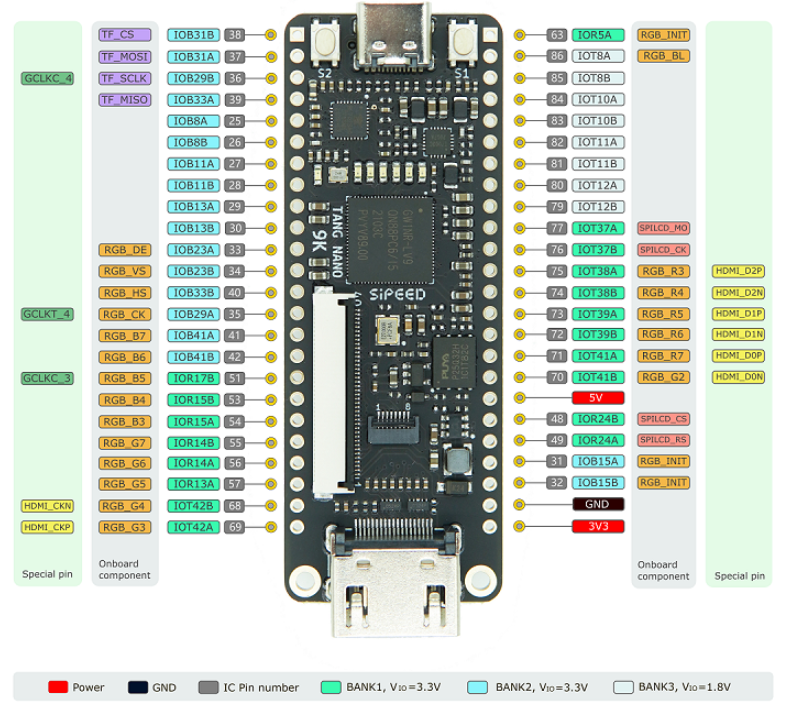
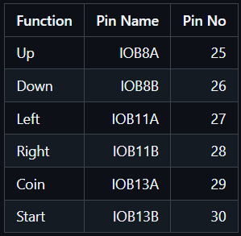

# FPGA Pacman (Tang Nano 9K)

Dieses Projekt implementiert **Pacman auf dem Tang Nano 9K FPGA**.

## Voraussetzungen

### 1. ROMs einfügen

Die Pacman-ROMs müssen in folgendes Verzeichnis kopiert werden:

```
Pacman-TangNano\tangnano9k\src\roms\
```

> Ohne die ROMs kann das Projekt nicht korrekt synthetisiert bzw. ausgeführt werden.

---

### 2. Kabeltreiber installieren

Für das Programmieren des FPGA-Boards müssen die **passenden USB-/Kabeltreiber** installiert werden.

---

## Pinout & Logiklevel

Die folgenden Pinout-Grafiken zeigen die Belegung des Boards bzw. des FPGA. **Alle Signale arbeiten mit 3,3 V Logikpegeln.**

| Board Pinout    | FPGA Pinout          |
| --------------- | -------------------- |
|  |  |

---

## Nutzung

Nach dem Einfügen der ROMs und der Installation der Treiber kann das Projekt in der entsprechenden FPGA-Toolchain geöffnet, synthetisiert und auf das Board geladen werden.

